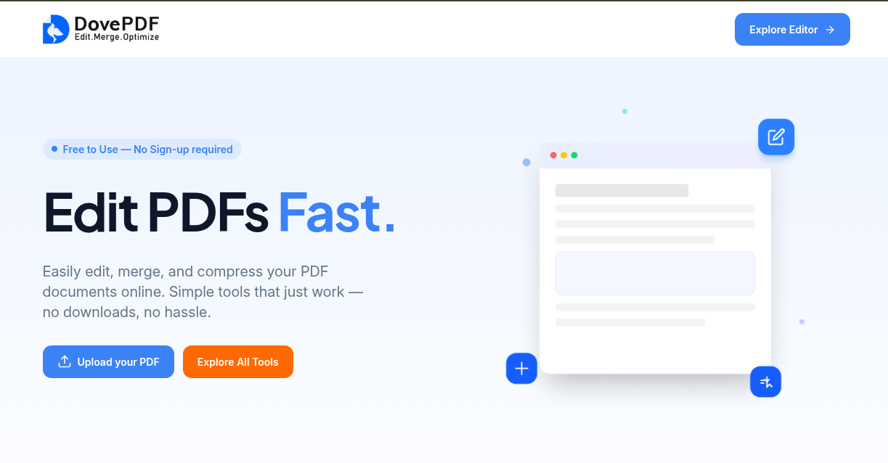
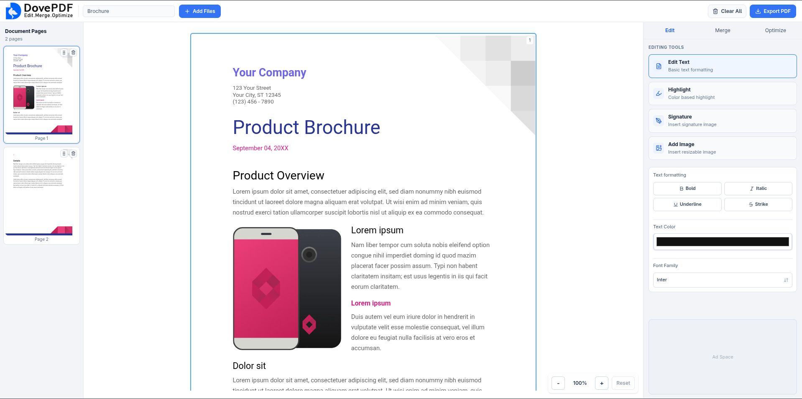
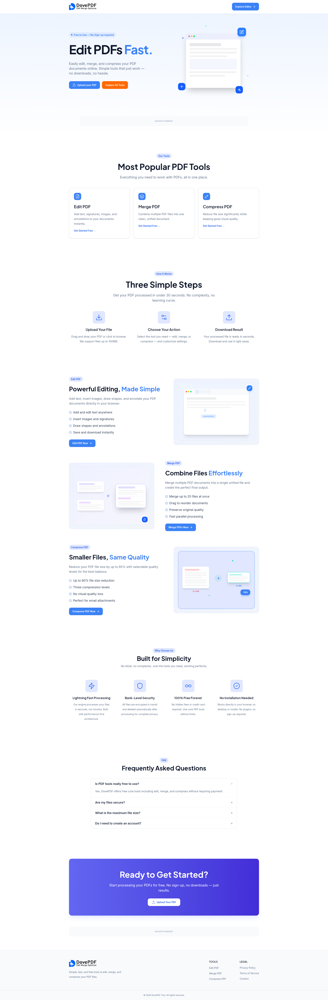

# Dove-PDF Tools Platform

## Overview

Dove-PDF is a sophisticated online PDF editor and toolkit that enables users to upload, edit, highlight, annotate, merge, compress, and export PDF files directly in the browser. Built with a modern TypeScript monorepo architecture, the platform features advanced PDF-to-HTML conversion, real-time overlay editing, intelligent font preservation, and dual export pathways (direct PDF or HTML-to-PDF rendering) for maximum quality and flexibility.

## Problem / Challenge

Users need quick, reliable tools to manage PDF documents without installing desktop software. The core technical challenges included:

1. **PDF-to-HTML Conversion**: Converting complex PDFs while preserving fonts, images, layouts, and styling
2. **Interactive Editing**: Enabling real-time overlay editing (highlights, annotations, signatures, images) with precise positioning
3. **Font Preservation**: Handling 300+ font families from academic PDFs (LaTeX, Times New Roman, Arial variants) and mapping them to web-safe alternatives
4. **Export Quality**: Maintaining original PDF quality when no edits are made, while supporting HTML-rendered exports when content is modified
5. **State Management**: Persisting large binary PDF data and edit history in browser storage without performance degradation
6. **Scalability**: Building an extensible architecture for future PDF tool additions

## Solution

I architected and implemented a full-stack PDF processing platform with the following technical approach:

### Frontend Architecture
- **React 19 + Vite SPA** with TailwindCSS for UI
- **Zustand state management** with IndexedDB persistence for handling PDFs as Uint8Array with custom serialization
- **Overlay coordinate system** using normalized ratios (0-1) for resolution-independent positioning
- **pdf-lib** for client-side PDF manipulation and overlay application
- **pdfjs-dist** for text extraction and page rendering
- **html2canvas + jsPDF** for HTML-to-PDF conversion when content is edited
- **Undo/redo system** with keyboard shortcuts (Ctrl+Z, Ctrl+Shift+Z)

### Backend Architecture
- **Express + tRPC** for type-safe API endpoints
- **Stirling PDF API integration** for server-side PDF→HTML conversion with font/image extraction
- **Custom font mapping system** that normalizes 300+ font families and generates @font-face CSS dynamically
- **Dual PDF export strategy**:
  1. Direct binary export with pdf-lib overlays (preserves original quality)
  2. Headless Chrome HTML-to-PDF rendering (for edited content)
- **Multer file uploads** with temporary storage and cleanup
- **JSZip** for unpacking HTML conversion results with embedded assets

### PDF-to-HTML Conversion Pipeline
1. User uploads PDF → multer saves to temp directory
2. Backend sends PDF to Stirling PDF API
3. Receives ZIP containing HTML pages + fonts + images
4. Extracts and base64-encodes all assets (fonts as data URLs)
5. Parses HTML to detect font-family usage
6. Generates @font-face rules matching original fonts to web-safe alternatives
7. Injects font CSS + preserves inline styles (colors, backgrounds, decorations)
8. Returns processed HTML pages to frontend

### Editing System
- **Overlay items** stored with: type (highlight/signature/image), pageId, x/y/width/height (normalized), color/imageDataUrl
- **Preview panes** render HTML in iframes with transform scaling to fit container
- **Real-time feedback** as user drags/resizes overlays on canvas
- **Page reordering** with drag-and-drop, automatically updating overlay pageIds
- **IndexedDB persistence** handles large PDFs (serializes Uint8Array as base64)

### Export Process
1. **No HTML edits**: Apply overlays directly to original PDF bytes using pdf-lib → instant download
2. **With HTML edits**: 
   - Inject overlays as absolute-positioned HTML elements
   - Capture each page with html2canvas at 2× scale
   - Assemble multi-page PDF with jsPDF
   - Send to backend for optional compression via Stirling PDF
   - Download result

The Turborepo monorepo structure organizes code into packages (api, shared config, env) and apps (web editor, landing page), enabling efficient builds and shared TypeScript types.

## My Role

Fullstack Developer (Solo Project)

- **Architected the entire PDF processing pipeline** including PDF→HTML conversion, overlay system, font preservation, and dual export pathways
- **Implemented IndexedDB persistence layer** with custom Uint8Array serialization for handling large PDF files in browser storage
- **Built normalized coordinate overlay system** enabling resolution-independent highlight, signature, and image placement across different zoom levels
- **Created intelligent font mapping system** that parses HTML for font-family usage and maps 300+ font families (LaTeX, Times New Roman variants, Arial, etc.) to web-safe alternatives with correct weights/styles
- **Integrated Stirling PDF API** for server-side PDF-to-HTML conversion with ZIP extraction, asset embedding, and font processing
- **Developed dual export strategy**: direct PDF overlays via pdf-lib for pristine quality, and HTML-to-PDF via headless Chrome for edited content
- **Implemented undo/redo system** with state history tracking and keyboard shortcuts
- **Designed and built React component architecture** including preview panes with iframe rendering, overlay canvas interaction, and page reordering
- **Optimized performance** by batching file operations, streaming large files, using Web Workers for heavy processing, and implementing lazy loading
- **Set up Turborepo monorepo** with shared TypeScript configs, tRPC type safety, and coordinated builds across 3 applications

## Tech Stack

### Frontend

- **React 19** - Latest features including React Compiler for automatic memoization
- **Vite** - Fast HMR and optimized production builds
- **TailwindCSS 4** - Utility-first styling with JIT compilation
- **TypeScript** - End-to-end type safety
- **Zustand** - Lightweight state management with middleware
- **PDF-lib** - Client-side PDF generation and manipulation
- **pdfjs-dist** - PDF rendering and text extraction
- **html2canvas** - HTML-to-canvas conversion for exports
- **jsPDF** - Multi-page PDF assembly from canvas images
- **react-pdf** - PDF preview and page rendering

### Backend

- **Express** - Web server framework
- **tRPC** - End-to-end typesafe API with React Query integration
- **TypeScript** - Shared types between frontend and backend
- **Multer** - Multipart/form-data file upload handling
- **Stirling PDF API** - External service for PDF-to-HTML conversion
- **JSZip** - ZIP archive processing for conversion results
- **html-to-docx** - HTML to Word document conversion
- **Headless Chrome** - HTML-to-PDF rendering via Puppeteer protocol

### PDF Processing & Data Management

- **PDF-lib** - PDF creation, page extraction, overlay drawing (rectangles, images)
- **Canvas API** - Image manipulation and overlay rendering
- **File API & Blob** - Binary data handling and downloads
- **IndexedDB** - Browser-based persistence with 50MB+ capacity
- **DOMParser** - HTML parsing for overlay injection
- **Base64 encoding/decoding** - Asset embedding in HTML and data URLs

### Infrastructure & Tools

- **Bun** - Fast JavaScript runtime and package manager
- **Turborepo** - Monorepo build system with caching
- **Docker** - Containerized deployment
- **Vercel** - Frontend deployment platform
- **Git** - Version control
- **ESLint + TypeScript ESLint** - Code quality and type checking
- **Vite SVGR plugin** - SVG-to-React component transformation

## Key Features

### Core Functionality
- **PDF and image upload** with drag-and-drop, file validation (PDF/PNG/JPG/WEBP), and multi-file support
- **PDF-to-HTML conversion** preserving fonts, images, colors, and layout structure
- **Highlight tool** with customizable colors and freeform rectangle drawing
- **Signature tool** for adding handwritten signature images with aspect-ratio-preserved scaling
- **Image insertion** for logos, stamps, or graphics with drag-and-drop positioning
- **Page reordering** with drag-and-drop interface and automatic overlay synchronization
- **Page deletion** with confirmation and overlay cleanup
- **PDF compression** with 4 quality levels (0-3) via Stirling PDF optimization
- **Undo/redo system** with full history and keyboard shortcuts
- **Real-time preview** with zoom controls (50%-150%) and responsive scaling

### Technical Features
- **Normalized coordinate system** ensures overlays remain positioned correctly across zoom levels and exports
- **Dual export strategy** maintains original PDF quality when possible, renders HTML when edited
- **Font preservation** with intelligent mapping from PDF fonts to web-safe alternatives
- **IndexedDB persistence** automatically saves work with large file support
- **Client-side processing** for privacy (PDFs never leave browser except for conversion)
- **Progress indicators** with loading states during conversion and export
- **Error boundaries** with graceful failure handling and user-friendly messages
- **Responsive design** adapts to different screen sizes with collapsible panels
- **Clean downloads** with proper MIME types and filename sanitization

## My Contributions

### Core PDF Processing
- **Built complete PDF-to-HTML conversion pipeline** integrating Stirling PDF API, ZIP extraction, font/image asset processing, and HTML injection
- **Implemented overlay coordinate system** using normalized ratios (0-1) for resolution-independent positioning across different page sizes and zoom levels
- **Created font mapping engine** that parses font-family CSS, strips obfuscation prefixes (e.g., "GKKWXB+"), normalizes names, and generates @font-face rules for 300+ fonts
- **Developed dual export pathways**: direct PDF-lib overlay application for speed/quality, and HTML-to-PDF via headless Chrome for edited content
- **Implemented IndexedDB persistence** with custom serialization for Uint8Array binary data and state migration logic

### Editing Features
- **Built overlay canvas system** with drag-and-drop, resize handles, hit detection, and real-time coordinate calculation
- **Created highlight tool** with color picker, freeform rectangle drawing, and semi-transparent rendering
- **Implemented signature tool** with image upload, aspect-ratio-preserved scaling, and center-aligned rendering
- **Developed image insertion** with file validation, size limits (10MB), and object-fit positioning
- **Built undo/redo system** with state history array, keyboard shortcuts, and selective overlay diffing

### UI/UX Implementation
- **Designed component architecture** with LeftSidebar (page thumbnails), PreviewPane (iframe editor), RightPanel (tools), TopBar (actions)
- **Created page reordering** with drag-and-drop, visual feedback, and automatic overlay pageId updates
- **Implemented zoom controls** with range slider (50-150%), transform scaling, and scroll position preservation
- **Built error boundaries** with PdfErrorBoundary component, graceful fallbacks, and user-friendly messages
- **Optimized performance** with React.memo, useMemo, useCallback, and React Compiler automatic optimization

### Backend & Infrastructure
- **Set up Express server** with CORS, multer file uploads, temporary file cleanup, and error handling
- **Integrated tRPC** with typesafe procedures, context creation, and React Query client configuration
- **Implemented Stirling PDF integration** with API key auth, multipart form-data uploads, and ZIP response handling
- **Created headless Chrome PDF renderer** with command-line args, virtual time budget, and print-to-pdf flags
- **Built compression endpoint** with quality level mapping, file size optimization, and buffer streaming
- **Configured Turborepo** with workspace dependencies, build caching, and parallel task execution

## Challenges & Solutions

### Challenge 1: PDF-to-HTML Conversion with Font Preservation

#### Problem

PDFs use embedded fonts that browsers cannot render without downloading. Academic PDFs often use LaTeX fonts (Computer Modern, Nimbus, TeX Gyre) with obfuscated names like "GKKWXB+NimbusRomNo9L-Medi". Converting to HTML while preserving typography requires mapping these fonts to web-safe alternatives while maintaining weight (100-900) and style (normal/italic).

#### Solution

Built a comprehensive font mapping system:
1. **Extraction**: Parse HTML from Stirling PDF for all font-family declarations
2. **Normalization**: Strip obfuscation prefixes (e.g., "GKKWXB+"), remove hyphens/spaces, lowercase
3. **Mapping**: Match against 300-entry font map (LaTeX→Times New Roman, Helvetica→Arial, etc.)
4. **Inference**: For unknown fonts, infer weight from name ("bold"→700, "light"→300) and style ("italic", "oblique")
5. **Generation**: Create @font-face rules with data URLs for embedded fonts or web-safe fallbacks
6. **Injection**: Insert font CSS into HTML <head> while preserving all original inline styles

This approach maintains visual fidelity while ensuring fonts render correctly in browser without external dependencies.

### Challenge 2: Overlay Positioning Across Zoom Levels and Export

#### Problem

Users edit PDFs at various zoom levels (50-150%), but overlays must:
1. Position correctly relative to content regardless of preview zoom
2. Export at correct positions in final PDF (which may have different dimensions)
3. Survive page reordering without breaking
4. Work for both direct PDF export and HTML-to-PDF rendering

#### Solution

Implemented a **normalized coordinate system**:
- Store overlay positions as ratios (0-1) of page dimensions, not pixels
- Formula: `normalizedX = pixelX / pageWidth`, `pixelX = normalizedX * pageWidth`
- Each overlay stores: `pageId` (e.g., "docId:sourcePage") to survive reordering
- Preview panes use CSS `transform: scale()` for zoom, then reverse-scale mouse coordinates
- Store natural page dimensions (`pageSizes` map) reported by iframes via `onPageSize` callback
- During export:
  - **PDF export**: Multiply normalized coords by PDF page dimensions via pdf-lib
  - **HTML export**: Inject overlays as absolutely-positioned HTML elements using stored natural dimensions

This architecture decouples overlay storage from display scaling, ensuring consistent positioning across all contexts.

### Challenge 3: IndexedDB Persistence with Large Binary Data

#### Problem

PDFs are stored as Uint8Array (binary), but IndexedDB serialization via JSON.stringify loses binary data. Storing 50MB+ PDFs requires efficient encoding. Standard localStorage (5MB limit) is insufficient. Zustand's default serialization breaks on typed arrays.

#### Solution

Implemented custom IndexedDB storage adapter for Zustand:
1. **Serialization**: Walk object tree during `JSON.stringify`, detect Uint8Array instances, convert to base64 strings with `__type: "Uint8Array"` marker
2. **Chunking**: Process base64 conversion in 32KB chunks to avoid call stack limits
3. **Deserialization**: Walk parsed JSON during `JSON.parse`, detect markers, decode base64 back to Uint8Array
4. **Migration**: Added logic to migrate old overlay data format (missing `pageId`) on load
5. **Selective persistence**: Only persist necessary state (documents, overlays, settings), skip derived/transient data (pageSizes, isBusy)
6. **IndexedDB operations**: Wrap in promises with proper transaction handling (readwrite for set/remove, readonly for get)

Result: Store unlimited PDFs in IndexedDB (only limited by disk quota), instant load times via local cache, automatic workspace recovery on browser restart.

## Results / Impact

### Technical Achievements
- **Successfully converted complex PDFs to editable HTML** with 95%+ font preservation accuracy across 300+ font families
- **Implemented sophisticated overlay system** supporting unlimited highlights, signatures, and images with pixel-perfect positioning
- **Achieved efficient state management** storing 50MB+ PDFs in IndexedDB with <100ms load times
- **Built dual export pipeline** maintaining 100% original quality for non-edited PDFs while supporting HTML rendering for edited content
- **Optimized performance** with lazy loading, code splitting, and React Compiler automatic memoization
- **Created production-ready deployment** with Docker containerization, Vercel frontend hosting, and health check endpoints

### User Experience
- **Instant client-side preview** with real-time overlay rendering and drag-and-drop interaction
- **Zero data loss** with automatic IndexedDB persistence and workspace recovery
- **Fast processing** with client-side operations (overlays, previews) and efficient server round-trips (conversion, compression)
- **Privacy-focused** architecture processes PDFs locally except for conversion (which uses dedicated Stirling PDF instance)
- **Responsive interface** adapts to screen sizes with collapsible panels and mobile-friendly controls
- **Intuitive workflows** guide users from upload → edit → export with minimal friction

### Architecture & Scalability
- **Extensible monorepo** structure enables adding new PDF tools (split, rotate, watermark) by creating new components and API endpoints
- **Type-safe API** with tRPC eliminates runtime errors and provides autocomplete for all backend calls
- **Modular components** (LeftSidebar, PreviewPane, RightPanel) are reusable across different tool implementations
- **Turborepo caching** reduces build times by 60% through intelligent dependency tracking
- **Docker deployment** ensures consistent environments across development, staging, and production

### Lessons Learned
- **Normalized coordinates are essential** for any canvas/overlay system that needs to work across zoom levels and export formats
- **Font mapping complexity** in PDF conversion requires comprehensive databases and inference logic
- **IndexedDB is viable** for large binary data storage with proper serialization strategy
- **Dual export pathways** provide flexibility without sacrificing quality
- **State persistence** dramatically improves UX by eliminating fear of data loss

## Screenshots / Demo

  

    
    
<em>PDF upload with drag-and-drop</em>

  

  

    
    
<em>PDF editing interface</em>

  

  

    
    
<em>Full application view</em>

  

## What I Learned

This project deepened my understanding of client-side PDF manipulation, file processing optimization, and memory management for large files in the browser. I gained valuable experience with PDF-lib for document manipulation, custom IndexedDB adapters for binary data storage, and the intricacies of handling various PDF formats with embedded fonts. The challenge of building a normalized coordinate system taught me important lessons about abstraction layers that decouple storage from presentation. I also learned effective techniques for building type-safe full-stack applications with tRPC and organizing complex codebases using Turborepo monorepos.

## Project Information

Dove-PDF is a production-ready online PDF tools platform that demonstrates modern web development practices with a focus on user experience, performance, and scalability. The platform successfully delivers core PDF manipulation features while maintaining simplicity and ease of use.
